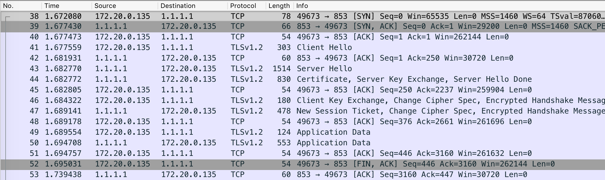

# Transparent DNS to DNS-over-TLS proxy

Simple proxy that captures plain text UDP DNS requests from the host, redirects the query over an ecrypted channel to a DNS server that supports TLS (for example, [Cloudflare's 1.1.1.1](https://1.1.1.1/) or [Quad9's 9.9.9.9](https://www.quad9.net/)), and replies back to the client with the answer. I made this project only for learning purposes, any PR to correct something or improve it will be very much appreciated.


### Implementation

Since 53/UDP is the default port/protocol for DNS queries as per [RFC-1035](https://www.ietf.org/rfc/rfc1035.txt) and [RFC-1536](https://tools.ietf.org/html/rfc1536), the application binds a datagram type socket to the host. This port could be changed to a different one if desired (see [Usage](https://github.com/briancurt/encrypted-dns-proxy#usage)). Upon receiving a query the program starts a new thread to process it. It then begins to wrap a new TCP socket using SSL and verify the certificate over port 853 as described on [RFC-7858](https://tools.ietf.org/html/rfc7858). The full message is formatted according to [RFC-1035](https://tools.ietf.org/html/rfc1035) as first bit 0 (QUERY) + lenght + query and sent to the server over the encrypted connection. When it gets the reply, it checks the answer for errors specifically on the RCODE bits as detailed on [RFC-6895-2.3](https://tools.ietf.org/html/rfc6895#section-2.3). If the query was successful, forwards back the result to the client minus the first 2 bits. The application can run both as a standalone script or a Docker container.


### Usage

The program uses built-in Python 3.6.5 libraries and can be used directly from a terminal if desired. Just clone the repo and you're all set:

```
$ ./proxy.py --help

usage: proxy.py [-h] [-p PORT] [-a ADDRESS] [-d DNS] [-c CA]

Transparent DNS to DNS-over-TLS proxy.

optional arguments:
  -h, --help            show this help message and exit
  -p PORT, --port PORT  Port of the listening proxy [default: 53]
  -a ADDRESS, --address ADDRESS
                        Address of the proxy network interface to use
                        [default: 0.0.0.0]
  -d DNS, --dns DNS     Domain name server with TLS support [default: 1.1.1.1]
  -c CA, --ca CA        Path to the root and intermediate certificates file
                        [default: /etc/ssl/cert.pem]
```

It also works as a Docker container. Simply run:

`docker run --rm -p 53:53/tcp -p 53:53/udp briancurt/encrypted-dns-proxy`

If instead of using the default (and recommended) port 53 you want to have the proxy on a different port, and thus use the `-p` flag, don't forget to expose the corresponding ports at container run time. The same applies if you want to use a different CA bundle through the `-c `  flag, please mount the host disk with the right file(s). You can use the default DNS, or use any other server that supports TLS by passing the `-d` flag.


### Testing

After you start the proxy, you can test it out in a couple of different ways. Simply using tools such as `dig`, `netcat`,  `curl` (you need to build libcurl to use [c-ares](https://c-ares.haxx.se/) to have the `--dns-servers` option available), or [Wireshark](https://www.wireshark.org/). You can also point the whole host machine DNS to `127.0.0.1`, open some pages on a web browser, and watch the logs on the proxy terminal.



Notice the DNS padding by Cloudflare:

```
$ ./proxy.py
$ dig @127.0.0.1 github.com

; <<>> DiG 9.10.6 <<>> @127.0.0.1 github.com
; (1 server found)
;; global options: +cmd
;; Got answer:
;; ->>HEADER<<- opcode: QUERY, status: NOERROR, id: 21715
;; flags: qr rd ra; QUERY: 1, ANSWER: 2, AUTHORITY: 0, ADDITIONAL: 1

;; OPT PSEUDOSECTION:
; EDNS: version: 0, flags:; udp: 1452
; PAD: 00 00 00 00 00 00 00 00 00 00 00 00 00 00 00 00 00 00 00 00 00 00 00 00 00 00 00 00 00 00 00 00 00 00 00 00 00 00 00 00 00 00 00 00 00 00 00 00 00 00 00 00 00 00 00 00 00 00 00 00 00 00 00 00 00 00 00 00 00 00 00 00 00 00 00 00 00 00 00 00 00 00 00 00 00 00 00 00 00 00 00 00 00 00 00 00 00 00 00 00 00 00 00 00 00 00 00 00 00 00 00 00 00 00 00 00 00 00 00 00 00 00 00 00 00 00 00 00 00 00 00 00 00 00 00 00 00 00 00 00 00 00 00 00 00 00 00 00 00 00 00 00 00 00 00 00 00 00 00 00 00 00 00 00 00 00 00 00 00 00 00 00 00 00 00 00 00 00 00 00 00 00 00 00 00 00 00 00 00 00 00 00 00 00 00 00 00 00 00 00 00 00 00 00 00 00 00 00 00 00 00 00 00 00 00 00 00 00 00 00 00 00 00 00 00 00 00 00 00 00 00 00 00 00 00 00 00 00 00 00 00 00 00 00 00 00 00 00 00 00 00 00 00 00 00 00 00 00 00 00 00 00 00 00 00 00 00 00 00 00 00 00 00 00 00 00 00 00 00 00 00 00 00 00 00 00 00 00 00 00 00 00 00 00 00 00 00 00 00 00 00 00 00 00 00 00 00 00 00 00 00 00 00 00 00 00 00 00 00 00 00 00 00 00 00 00 00 00 00 00 00 00 00 00 00 00 00 00 00 00 00 00 00 00 00 00 00 00 00 00 00 00 00 00 00 00 00 00 00 00 00 00 00 00 00 00 00 00 00 00 00 00 00 00 00 00 00 00 00 00 00 00 00 00 00 00 00 00 00 00 00 00 00 (".........................................................................................................................................................................................................................................................................................................................................................................................................")
;; QUESTION SECTION:
;github.com.			IN	A

;; ANSWER SECTION:
github.com.		45	IN	A	192.30.253.113
github.com.		45	IN	A	192.30.253.112

;; Query time: 155 msec
;; SERVER: 127.0.0.1#53(127.0.0.1)
;; WHEN: Thu Oct 25 16:39:31 -03 2018
;; MSG SIZE  rcvd: 468
```
